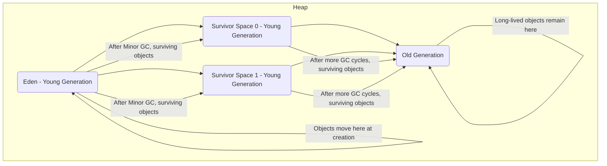

# Java Performance tuning notes taken from https://www.udemy.com/course/java-application-performance-and-memory-management

These notes are to provide a starting point for more advanced topics relating to the JVM.

🧂*Will require updating for more recent java. Principles remain the same*

---

# Just In Time compilation

### What is ByteCode

### JVM Just In Time Compilation

- Compiler performs optimisations
    - Popular code is ran native machine code (runs faster) - code that can be understood by the OS
    - Some code is run as interpreted bytecode
    - Implication -> Code will run faster the longer it is left run
        - Virtual machine can profile the code
        - Process of compiling is ran in a separate thread
            - Thread running the code that is interpreting the byte code and executing the byte code won't be affected
              by the thread doing the JiT compiling
            - The process of JiT compiling doesn't stop the applications running
            - While compilation is taking place, the JVM will continue to use an interpreted version, but once that
              compilation is complete and the native machine code version is available, the virtual machine will
              seamlessly switch to use the compiled version instead of the raw bytecode.
            - If application is heavy on CPU processing using all available CPU resources a potential performance hit
              might by seen if JiT is taking place.
                - This would only be noticed in high power, critical applications. May still be worth it for the
                  performance benefits of native code despite the dip in processing
                    - Impact of JiT is that consideration needs to be given to when the performance of an application
                      occurs
                        - Result may differ when code is initially ran vs when it has been running for a while.
                - Need to consider the performance of the code before and after it has been natively compiled
- Any piece of bytecode can be compiled to native code

### `-XX:+PrintCompilation` used to find which methods are being compiled

## JIT Compilation Explained (`-XX:+PrintCompilation`)

This project demonstrates how Java's Just-In-Time (JIT) compiler works using a simple method that's called repeatedly to
trigger optimization.

### JIT Compilation Output Columns

| **Column**      | **Example**                          | **Description**                                                                                                                                      |
|-----------------|--------------------------------------|------------------------------------------------------------------------------------------------------------------------------------------------------|
| Timestamp       | `45`                                 | Time (ms) since JVM start when the method was compiled.                                                                                              |
| Compilation ID  | `2`                                  | Unique ID for the compiled method.                                                                                                                   |
| Tier            | `3`                                  | Compilation level: `0`=interpreter, `1–3`=C1, `4`=C2 (optimized tier).                                                                               |
| Method Name     | `performanceTuning.JITDemo::compute` | Full class and method being compiled.                                                                                                                |
| Bytecode Length | `(17 bytes)`                         | Length of the method's bytecode.                                                                                                                     |
| Suffix / Note   | `made not entrant`, `%`, `!`, `n`    | Extra info: <br> `%`: OSR (On-Stack Replacement)<br> `!`: Deoptimization<br> `n`: Native method<br> `made not entrant`: JIT invalidated this version |

---

### Running with JIT Flags

```bash
javac */JITDemo.java
java -XX:+PrintCompilation *.JITDemo
```

### C1 and C2 compilers, logging the compilation activity

- C1 compiler does the first three levels of compilation
- C2 does more advanced compilation
- Virtual machine decides which level of compilation to apply to a particular block of code based on how often it is
  being run and how complex or time consuming it is.
    - Referred to as profiling the code
        - C2 code is even more optimised than C1 code
- Only frequently used code is optimised
    - If the code doesn't perform anything complex than there may be no performance benefit
    - JVM can also place code in the *code cache*
- `java -XX:+UnlockDiagnosticVMOptions -XX:+LogCompilation ....`

### Tuning the code cache size

- C2 compiled code may be placed in the code cache for improved performance.....cache is limited size...swapping can
  occur
    - If cache is full, application console may produce this error
      `VM warning CodeCache is full. Compiler has been disabled`
    - Can use `-XX:+PrintCodeCache` to find out about size of the code cache
- In more complex applications, if the size of the used memory is getting close to the size of the code cache then a
  tweaked code cache might be helpful
    - Maximum size of code cache is dependent on the version of Java you are using
- Changing the code cache size
    - `InitialCodeCacheSize` - size when application starts
    - `ReservedCodeCacheSize`- maximum size of the code cache, how much it grow to if needed
    - `CodeCacheExpansionSize` - dictates how quickly the code cache should grow as it becomes populated
    - Example: `java -XX:ReservedCodeCacheSize=32g/k/m`

### Remotely monitoring the code cache with **JConsole**

- Can cause extra overhead and use extra memory of the code cache

---

# Selecting the JVM

## When downloading a JVM there is a choice of 32 Bit and 64 Bit JVM

| 32 Bit                        | 64 Bit                                                               |
|-------------------------------|----------------------------------------------------------------------|
| Might be faster if heap < 3GB | Might be faster if using longs and doubles                           |
| Max heap size = 4GB           | Required if heap is > than 4GB                                       |
|                               | Max heap size is OS dependent                                        |
| Client compiler only          | Client and server compilers                                          |
|                               | Use client compiler only`-client`. Ignored on some operating systems |
|                               | Use 32bit server compiler only`-server`.                             |
|                               | Use 64bit server compiler only`-d64`.                                |

- 32GB doesn't include the C1 and C2 compiler only C compiler
- Consider C1 and C2 as Client vs Server in terms of what the application is going to do.
- For short lived applications that have low memory requirements 32 bit JVM may perform better

## Turning of tiered compilation
`-XX:-TieredCompilation`

## Tuning native compilation within the Virtual Machine
- Can find out the value of all flags using `java -XX:+PrintFlagsFinal`
- get java process id `jps`
- `jinfo -flag CICompilerCount`
- `jinfo -flag CompileThreshold`
- `-XX:CICompilerCount=n` For larger applications increasing the number of threads doing the compiling may make a difference
- `-XX:CompileThreshold=n` - the number of times a method needs to run before being natively compiled

## Java Memory

Three parts: Stack, Heap and Metaspace

### The Stack
- Every thread has its own stack
- Managed by the JVM
- JVM knows when data on the stack can be destroyed
- Stack data can only be seen by the thread that owns that stack
- Can only store simple data types

### The heap
- Data on the heap can be accessed by multiple threads if programmed that way
- Used for objects
- Java Memory Rules
  - Objects are stored on the heap
  - Variables are a reference to the object
  - Local variables are stored on the stack

---

# How memory works - the stack and the heap

## The structure of Java's memory

## How the stack works

## How the heap works

## The heap and stack together - Example

---

# Passing objects between methods

## Passing by value

## Passing by reference

## Passing objects into methods

## Final keyword and why it is not the same as a constant

## Why the final keyword doesn't stop an objects values from being changed

---

# Escaping References

## What is an escaping reference

## Strategy 1 - Using an iterator

## Strategy 2 - Duplicating collections

## Strategy 3 - Using immutable collections

## Strategy 4 - Duplicating objects

## Strategy 5 - Using interfaces to create immutable objects

## Strategy 6 - Using modules to hide the implementation

---

# The Metaspace and Internal JVM memory optimisations

## The role of the Metaspace
- Used to store metadata
  - This information is used to primarily store information about classes, methods like which methods have been compiled into bytecode and which have been compiled into native code.
  - It is also where Static variables are stored
    - Can think of the meta space as having the same role as the stack for any object or any variable that we declare a static variable
    - Static primitives are stored entirely in the meta space and static objects are stored on the heap, but with the object pointer or reference held in the meta space
      - Variables in the meta space are permanently there and never reach a state where they can be garbage collected
    - All classes and all threads have access to within a Java program have access to the meta space. Hence the same for static variables
    - Public and private refer to data than can be seen outside of a class

## The PermGen
*Java 7 specific*

## Are objects always created on the heap?
- Java heap scope is managed by brackets/code blocks
- All objects go on the heap in Java
- An object that is not shared...i.e only exists in that code block will actually be placed on the Stack via JVM optimisations
- 
## The String Pool
- String are immutable, same strings will have the same references despite being seen as two different objects
- This won't work for calculated Strings
  - Virtual machine can detect these things, string deduplication. See the underlying value and remove one of them.

## Interning Strings
- Placing strings in the string pool `String abc = someOtherObjectInstance.toString().intern()`
  - Only calculated strings and very long string will not be placed in the string pool, otherwise it is usually automatic

---

# Tuning the JVM's memory settings

## How the string pool is implemented
- Implemented using a HashMap
  - 16 Buckets. String is hashed and then placed in one of these buckets
    - Two identical objects will always have the same hashcode

## Understanding the size and density of the string pool
- Can use `-XX:+PrintStringTableStatistics`
- Important to be away for the density of the String pool for larger applications

## Tuning the size of the string pool
- `-XX:StringTableSize=(use a prime here)` -use a prime number for efficiency
  - If the average bucket size is 40+ it may be worth changing this

## Tuning the size of the heap
- Must be big enough to store the string pool
- When dealing without of memory errors don't just increase the max heap size....actual issue is probably a memory leak
  - May be worth right sizing the heap when given prior knowledge

## Shortcut syntax for heap tuning flags
-XX:+PrintStringTableStatistics
-XX:StringTableSize=n
-XX:MaxHeapSize=n -Xmx
-XX:InitialHeapSize=n -Xms
-XX:+UnlockDiagnosticVMOptions
-XX:+PrintFlagsFinal

---

# Introducing Garbage Collection

## What is meant by Java being garbage collected languages
- Java works out when objects are no longer needed 🌳🌳🌳🌳
  - Avoids **memory leaks 🧨**
- Memory leaks *shouldn't* be possible in Java 
  - If it does happen more than likely not the fault of the Java programmer
- Garbage collection also avoid memory leaks. Idea comes from Lisp, Java made it popular
- Automatic process will analyse the heap and work out which objects are no longer needed

## How Java knows which objects can be removed from the heap

- Any object on the heap which cannot be reached through a reference from the stack is "eligible for garbage collection"
    - References from the metaspace will also never be deleted
## The `system.gc()` method

- See JavaDocs
  - It's a suggestion to the VM not a command

## 🧂 Java 11s Garbage Collector can give unused memory back to the operating system
- Consider garbage collection algorithms
- Java 8 doesn't do this 🧨🧨🧨

## Why it's not a good idea to run the `System.gc()` method

- Garbage collection process is using up system resources so it can slow down or even temporarily halt the running of the main application while garbage collection runs.
  - Ideally want it to run in the most efficient way possible
  - Generally better to let the virtual machine decide
  - Could be used to check the performance of a block of code by running GC before it is executed. Still may be a bad idea

## The `finalize()` method
- This is run when the object is removed from the heap
  - Deprecated from Java 9
  - Don't use it
    - Don't put clean up code in it
    - Don't know if it is going to run or if it will ever run
    - **See docs for more info**
  - At the end of the program the JVM may not perform a GC. It will just destroy all the objects on the heap

## The danger of using `finalize()`

---

# Monitoring the Heap

## What is a soft leak
- When an object remains referenced when no longer needed

## Into to VisualVM
- Allows for viewing the stack and heap

## Monitoring the size of your heap over time

## Fixing the problem and check the heap size

---

# Analysing a heap dump

## Generating a heap dump
- Can be done via VisualVM
- Alternatively, you can use the following command line argument to enable and generate heap dumps automatically when an
  OutOfMemoryError occurs:
  `-XX:+HeapDumpOnOutOfMemoryError -XX:HeapDumpPath=/path/to/dump/directory`
  - Replace `/path/to/dump/directory` with the desired directory for storing the heap dump file.

## Viewing a heap dump
- Requires tools like Eclipse MAT

---

# Generational Garbage Collection

## How the garbage collector works out what is garbage
- Garbage collector needs to be efficient, use resources from CPU
  - More efficient garbage collection means less impact on application performance
- General principle
  - Rather than look for objects to remove, the garbage collector looks for all the objects that need to be retained and rescues them.
  - General algorithm is called mark and sweep. It is a two stage process. Marking and Sweeping.
    - The program execution is first paused and is called a "Stop the world event"
    - Marking cannot work properly if there are still threads executing....
      - *So all the threads in the application are paused*
      - The garbage collection then checks every live reference. This is easy to do.
        - Simply looks at every variable on the stack and in the meta space.
        - If there are static variables, it follows the reference, the object that it finds are marked as alive. (Tree traversal?)
      - Once all these objects are marked for keeping, a full scan of the heap can take place and memory occupied by the objects that have not been marked during the marking phase can then be freed up.
      - *Finally,* the objects that are being kept are moved into a single contiguous block of memory.
        - This stops the heap from becoming fragmented over time and makes it easier and quicker for the virtual machine to find an allocate memory to future objects.
        - It actually collects the objects which are not eligible for garbage collection and saves them.
        - *This actually mean that's the garbage collection process is faster, the more garbage there is*
          - If everything in the heap was garbage the garbage collection would be pretty much instantaneous.
            - Marking phase would take no time at all, since there would be little to mark and thus nothing to retain.
              - Most of the heap will be disposed of.

## Why the heap is divided into generations
- Issue is a "stop the world event". The application is paused while the marking phase runs.
  - Users will notice that our application has frozen for a few seconds and in some use cases that will not be acceptable.
  - This is avoided using generational garbage collection.
  - Understand that most objects in Java live for a very short period of time.
    - If an object survives one garbage collection, then it is more than likely to live forever.
    - *It's faster to run the garbage collection when there's a lost of garbage or when there's only a few objects that are going to survive*
    - To make this process as efficient as possible the heap is actually organised into separate sections. This is known as generational garbage collection.
  - Heap is divided into two sections.
    - One is called the young generation and another is called the old generation.
    - New objects are created in the young generation. The young generation space is quite small and will up quite quickly.
      - When its full, a garbage collection takes place but only on the young generation because most object don't survive for long.
      - The young generation, which is full of new objects is probably mostly garbage.
        - The process to garbage collect the young generation should be very quick.
        - There are very few object which need to be marked and its small anyway so it should take fractions of a second.
          - 🧨 Application will freeze while this takes place.
        - Any surviving objects are then moved to the old generation.
        - The young generation is no empty and any new objects can again get added to the young generation.
        - The young generation is now empty and any new objects can again get added to the young generation.
        - The garbage collection of the young generation is known as a minor collection.
          - As the application runs, there will be lots of minor garbage collections taking place, and they'll be quite small and mostly full of garbage.
        - Most of the time garbage collection doesn't look at the entire heap, only a small section of it
      - The old generation
        - Garbage collection will run on the older generation but only if it is needed.
        - This is called a major collection.
          - 🧨 It is a lot slower since the block of memory to sweep is larger.
        - The compacting process is also time-consuming
- This could take ?seconds? for a major garbage collection or factions of a second for minor garbage collections.
- Essentially, there are a lot of garbage collections on the young generations, but it can also be done on the large generations if it is needed.
- Theoretically minor garbage collections will have no noticeable impact.

## The internals of the Young Generation (Java 8)
- Split into three generations, Eden, s0 and s1.
  - When an object is created it is placed in the Eden space
  - Eden space is small. First GC cycle will happen quickly. Survivors will go to s0
  - The next time the garbage collections runs it will look at everything in the Eden space and s0
  - *All* survivors move to s1. Eden and s0 are empty again.
  - Next time it runs all survivors will move to s0 from s1 along with Eden.
    - s1 and s0 take alternating turns in holding surviving objects
- Every time the marking structure is done we are not actually looking at the entire young generation, we are looking at two thirds of it.
  - Either looking at Eden and s0 or s1
  - Slightly more efficient since we have a smaller space to consider
    - We will then have lots of garbage collections that will be extremely quick,
- Eden space is small, its a small space to sweep and most of it will be discarded as objects live for a very small-time.
- The process of compacting, i.e moving all the surviving objects into contiguous area of memory is very quick because we have an area of memory reserved just for either s1 or s0. (which ever is not being currently used)
- Negative impact
  - s1 or s0 will always be empty, so there will be a small amount of memory that is unused but it can be seen as a minor tradeoff.
    - Example 50MB heap - 46Heap used 4 remains. This 4 is an empty survivor space.
- *Each time an object moves from s0 to s1 and vice versa it can be considered as being one generation older*
  - i.e surviving 5 garbage collections means it has survived give garbage collections.
- *The threshold for this is configurable*
  - Once this threshold has been hit, it will move into the old generation.
- 🧨 Once the old generation is full a **major garbage collection** will take place and this is a much slower process.
- 



405:⁉⁉⁉⁉

## Notes on Modern Java Garbage Collection (GPT-Generated) 

### The Garbage Collector in Modern Java Versions (Java 9+)

#### Introduction to New Garbage Collectors

- Recent Java versions have introduced several new garbage collectors to improve application performance, scalability,
  and responsiveness. These include:
  - **G1 Garbage Collector (default since Java 9)**: Focuses on predictable pause times.
  - **Z Garbage Collector (introduced in Java 11)**: Designed for low-latency applications, with minimal pause times.
  - **Shenandoah Garbage Collector (introduced in Java 12)**: Focuses on reducing pause times by concurrent compacting.
  - **Epsilon Garbage Collector (introduced in Java 11)**: A no-op garbage collector for performance testing, where no
    memory reclamation is performed.

#### Key Features of G1 Garbage Collector

- **Region-based Heap Layout**:
  - Divides the heap into fixed-size regions instead of generational divisions (like young and old generations).
  - Each region can serve as Eden, Survivor, or Old space.
- **Concurrent Marking**:
  - Performs most of the marking phase concurrently, reducing pause times.
- **Evacuation Process**:
  - Moves live objects to a new region, compacting memory without full pauses.
- **Predictable Pause Times**:
  - Allows configuration of pause time goals using `-XX:MaxGCPauseMillis`.

#### Z Garbage Collector

- **Characteristics**:
  - Wide platform support since Java 15.
  - Extremely short pause times (<10 ms) regardless of heap size.
  - Supports heaps from small sizes up to 16 TB.
- **Key Features**:
  - Performs all heavy operations (marking and relocation) concurrently with application threads.
  - Low-latency design suitable for responsive systems.
- **Configuration**:
  - `-XX:+UseZGC` to enable ZGC.
  - Additional tuning options like `-XX:SoftMaxHeapSize` for heap over-allocation management.

#### Shenandoah Garbage Collector

- **Characteristics**:
  - Concurrent Compaction: Moves objects while the application runs, reducing the "stop-the-world" event duration.
  - Designed primarily for low-latency requirements.
- **Configuration**:
  - Enabled using `-XX:+UseShenandoahGC`.

#### Improvements in Generational Garbage Collection

- Modern garbage collectors like G1 still use generational GC for short-lived and long-lived objects. Key enhancements
  include:
  - Better management of young and old regions in G1.
  - Faster promotion of long-lived objects in ZGC and Shenandoah.

#### Epsilon Garbage Collector

- **Purpose**:
  - Designed for workloads where GC performance isn't critical, and memory is managed manually.
- **Use Cases**:
  - Performance testing and benchmarking.
- **Configuration**:
  - Enable with `-XX:+UnlockExperimentalVMOptions -XX:+UseEpsilonGC`.

#### Summary of GC Selection in Modern Java

- Use **G1** for general-purpose applications with predictable pause times.
- Use **ZGC** for ultra-low latency workloads with large heaps.
- Use **Shenandoah** for applications requiring consistent responsiveness.
- Use **Epsilon** for testing scenarios where memory reclamation is unnecessary.

## Viewing the generations in VisualVM
- Use visualVM to see some graphs / data on Java Processes.
  - Add appropriate plugins

## Viewing the heap when there's a soft leak
- 🧨🧨🧨🧨🧨 the graph will plateau. Old generation wil fill up and the GC will not be able to remove anything. Application has effectively stopped.
---

# Garbage Collector tuning and selection

## Monitoring Garbage Collections
- For Java 8 --- `-verbose:gc`
  - GC - *minor GC*
  - Full GC - *...*

## Turning off automated heap allocation sizing
- Java dynamically alters the size of the heap at run time
  - This can be turned off with `-XX:-UseAdaptiveSizePolicy` otherwise enabled by default
  - Can use `jinfo` to check flags on an application

## Tuning garbage collection - Old and young allocation
- Garbage collections that take place in the young generation are better for performance than garbage collections in the older generations
  - Young generation garbage collections are quick and efficient
- *Need to understand the behaviour of objects in an application*
- Can resize different parts of the heap
  - Less to young generation and more to old generation
    - Result: more frequent garbage collections on the younger generation, older generation will grow more steadily
- Can adjust the different thresholds
- Tuning collection flags
  - `-XX:NewRatio=n` example - if set to 4 than the old generation will be four times larger than the younger generation. Default is two, can be set to one.
  - 

## Tuning garbage collection - survivor space allocation
- `XX:SurvivorRation=n` - how much of the younger generation should be taken up by the survivor spaces
  - Example 8 would mean the size of the eden space will be eight times larger than one survivor space.

## Tuning garbage collection - generations needed to become old
- `-XX:MaxTenuringThreshold=n` - max value is 15 - 16 and higher is treated as infinity i.e keep everything in the younger generation
  - Infinity is a bad idea since half of your heap won't be used

## Selecting a garbage collector
- Types of collector:
  - Serial
  - Parallel
  - Mostly Concurrent
- Number of threads is irrelevant. Multithreaded not threaded etc. Application will pause while the GC runs.
  - Garbage collector will compete for CPU resources. Will run slower on lower CPU machines.

- Serial Collector `-XX:+UseSerialGC`
  - Uses a single thread. Usually not a good choice.
    - Useful when the Java application performance is not the most important thing
    - I.e when running other applications alongside the Java process.
    - Use this when you want other applications to get the most access to CPU resources.
    - Very useful for background tasks where you want the other application 

- Parallel Collector will perform garbage collections on the young generation (minor collections) `-XX:+UseParallelGC`
  - Will have multiple threads running or performing the garbage collection process.
  - Useful if you have multiple processors on your computer or processors that can handle multiple threads (always a niche case 😃)
  - Useful for larger data sets as well since it gives better performance than the serial collector
  - Sometimes called the throughput collector
  - *Usually* the default

- Mostly Concurrent
  - Closest thing you can get to real time garbage collector
    - In practice this is not possible
    - Still pauses when marking, continues while the sweep phase takes place.
    - 
  - Two types
    - The Mark Sweep Collector `-XX:+UseConcMarkSweepGC0`
    - G1 collector `-XX:+UseG1GC`

Note: Both are available from Java 8, in Java 9 default is mark sweep and in Java 10 default is the *Improved* G1

## The G1 garbage collector
- Heap is spit into regions, by default there are 2048
- Some regions are allocated to different parts of the heap. Some will be allocated to Eden, s0,s1 and the old generation.
  - Not all regions need to be allocated
- When Java decides that a garbage collection is needed in the young generation, it looks at those regions allocated to the young generation.
  - It does the garbage collection process, and then it can reallocate the number of regions allocated to each part of the young generation and give it what it thinks will be optimal performance.
  - Example: The GC might decide some of the regions that have been previously allocated to the survivor spaces should now be allocated to the Eden space and it could add some of the unallocated regions to the Eden space for example.
  - This happens every time a minor collection takes place.
- When a full garbage collection takes place, the garbage collector will work out for each region in the old generation, which regions are mostly garbage and it will collect the region from those regions first.
  - Note: Named G1 for the garbage first collector.
  - If a region contains only unreferenced objects then that's a complete garbage region and can be fully cleared and made available.
  - Doing a garbage collection on the entire region is not necessary.
    - Can still do a full garbage collection on the entire old generation if it is needed but hopefully that will be a rare occurrence.
- G1 should generally be better than the other type of garbage collector that we've been looking at.
  - Because when it needs to do a major collection, it can often do just a part of a major collection to free up enough memory.
  - And it has the ability to resize and reallocate different areas of the heap to different parts of the young and old generation, again to maximise performance.

## Tuning the G1 garbage collector
- Not required in most circumstances
  - Always a niche case
- `XX:ConcGCThreads=n` - number of concurrent threads available for the smaller regional collections, could consider the serial collector as well
- `-XX:InitiatingHeapOccupancyPercent=n`- Garbage collection process begins when the heap reaches a certain level of fullness.
  - By default, this is 45%
  - Unlike previous garbage collection processes which run either when Eden is full or if the survivor spaces are full, or if the old generation is full, G1 run when the heap is only 45% full.
  - Use flag to change. Experiment if trying to squeeze maximum performance.

## String de-duplication
- Needs G1 garbage collector and a flag set.
  - With this feature enabled, it allows the garbage collector to make more space if it finds duplicate string in the heap.
  - When this flag is on
    - Suppose there are two references to different string on the heap. They are not in the string pool, and they are not eligible for garbage collection because they have active references from the stack.
    - When the garbage collection runs and this feature is on; the GC will compare each of the strings.
      - If it finds that two strings have the same value, it will change the references to point to the same value
      - In turn this makes the second object immediately available for garbage collection.
        - This feature is quite efficient because it makes use of the string hashcode and compares them. This can be done reasonably quickly.
        - This is an extra process that incurs an extra overhead.
        - Useful if you know you are going to have a lot of duplicated strings and these string values will be objects and they will live for a long time.  i.e not garbage collected early.
          - Also, worth considering if the code is in a memory constrained environment.

---

# Using a profiler to analyse application performance

## Java Mission Control (JMC)
- Use case is CPU usage too high, network or disk usage?
  - Here we can use a profiler.
  - A separate application which can connect to out Java Virtual Machine and extract data for us to review.
  - The need to attach to the running JVM and can add additional overhead
    - Can lead to adverse performance while the profiler is attached.
    - Unavoidable
- Profiler options
  - Some are paid for
  - Open source: Java Mission Control integrated into Oracle JDK from Java 7
    - 
  - Can be compiled yourself

## Building the JMC binaries
- Add if needed

## Running JMC and connecting to a VM
- Generate instructions here

- See docs for depth

## Customising the overview tab
- Resulting dashboard is customisable

## The MBean browser tab
- Add different stats for viewing

## System, Memory and Diagnostic Commands tabs
- Info on tabs inside Java Mission Control

## Example
- Example project / generate my own 🎼
  - Worth giving threads names in multithreaded applications if possible (Scala???)
- Spotting a memory leak. After garbage collection memory isn't freed.
  - May need to let GC run a few times. JMC will help identify memory strain.
  - Can check for blocked threads

## Using the flight recorder 
- Separate mode.
  - Can be used to record various metrics from a JVM and use JMC to view those metrics. Similar to an airplane blackbox, used to investigate.
  - Does not provide live info. Either application has run or data is slightly behind.
  - A flight recording is actually a JVM function. JMC allows for analysis
    - Can specify via a command line argument or use JMC
    - Flag: `-XX:FlightRecorder` - continuous option is very useful for a production system
      - Can choose different levels of profiling. More profiling causes more overheads


- For more detailed information on Java Mission Control (JMC), refer to
  the [official documentation](https://docs.oracle.com/en/java/javase/11/jmc.html).

## Analysing a flight recording
- See chart

## Improving the application
- Generate example
---

# Assessing Performance

## Why bench marking isn't straight forward
- Use case: May have two implementations and we don't know which one is better
  - Focusing on a particular segment of code i,e microbench marking.
    - Not as basic as timing before and after due to Java compiler performing behind the scenes work like native compilation, garbage collection
    - Interested in running the code in isolation. Consider threads and hardware.
    - For thought. Code being run 1000s times a second may justify this approach.

## Setting up the code for benchmarking
- Insert "quick and dirty" example

## A simple approach to micro-benchmarking
- Track start and end time and subtract.....relatively crude.

## Adding in a warm-up period
- Trigger native compilation before running. Run the method a few times before testing
  - Then do the timing

## Comparing two code alternatives
- See / generate example


## Using Macro-benchmarking
- Bench marking the code in the context of the entire system. Measurement is subjective

---

# Benchmarking with JMH

## Installing the JMH benchmarking tool - Java Microbenchmark
- See docs
- Take care of the "warm up part"
- Analyses performance in a more production like environment
  - Will run code 1000s of times to produce a summary. JMH generally takes care of the stats


## Create and running benchmarks
- Use `@Benchmark` annotation
  - Normal for these things to take a long time

## Using different benchmark modes
-- See docs / generate info with assistant

---

# How Lists Work

## Importance

- Different data structures perform differently with the same workload

## The 8 different list implementations
- The list interface........note: the three with comments do not allow for generics:
  - ArrayList
  - CopyOnWriteArrayList
  - LinkedList
  - AttributeList // niche case. Child of the ArrayList
  - RoleList // niche to do with role objects
  - RoleUnresolvedList // niche to do with role objects
  - Stack
  - Vector

---

### The CopyOnWriteArrayList

- This data structure is costly when used for mutations. Better suited to traversals i.e iterating and retrieving for the list.
- Changes will cause a copy of the list. This is very bad for the heap.
- Consider using it when:
  - Writing a Multi-Threaded application
  - Multiple threads accessing the same list
  - Lots of iterations / reads
  - Few writes / addition / deletions

### The ArrayList
- Backed by a finite array. Default size in 10
  - Exceed capacity then a new copy is created and references from the old one are copied over
  - Old arraylist is discarded. Only references are stored in this.
    - Each time an ArrayList grows it grows by half of its current size. Can check source code for this.
  - Resizing can lead to inefficiency and more objects that require garbage collection.

### Specifying the initial size of an ArrayList
- Max size is the (largest integer in Java - 8)
  - Ideally put in a number large enough so that it can the number of object references.
    - Will save resizing performance hit and garbage collection
    - Overdoing it will result in wasted memory

### The Vector
- Left from Java 1.0
  - There for backwards compatibility
  - It is also threadsafe array list.
    - This comes at a performance cost.

### The Stack
- Child object of the vector
  - Queue and Dequeue exist
  - Generally not used but still there
  - Generally use LinkedLists

### The LinkedList
- See general LinkedList description

### Choosing the optimal list type
- Scenarios
  - New item at the end? Use a LinkedList or an ArrayList (performance issue if capacity is reached).
    - Getting to the end of a linked list is fast $O(n)$
  - New item at the start? Use a LinkedList, ArrayList will require shuffling to make space.
  - Deleting - ArrayList will need to shuffle** linkedList need to reassign pointers.
    - ArrayList can find element in O(1) linkedList needs to be traversed.

| **Feature**             | **ArrayList**                                                              | **LinkedList**                                                                             |
|-------------------------|----------------------------------------------------------------------------|--------------------------------------------------------------------------------------------|
| **Implementation**      | Uses a dynamic array to store elements.                                    | Uses a doubly linked list to store elements.                                               |
| **Access Time**         | O(1) for direct access using an index.                                     | O(n) for access, as traversal is needed to reach the desired element.                      |
| **Insertion (End)**     | O(1) if there is capacity; O(n) when resizing is necessary.                | O(1) for insertion at the end/head.                                                        |
| **Insertion (Middle)**  | O(n) as elements are shifted to create space.                              | O(n) due to traversal, but no shifting of elements.                                        |
| **Deletion**            | O(n) as elements are shifted to fill the gap after removal.                | O(n) due to traversal, but involves only pointer reassignment.                             |
| **Memory Usage**        | Better memory utilization due to array backing.                            | Requires more memory because of the storage of pointers.                                   |
| **Iterating**           | Fast iteration over elements.                                              | Iteration can be slower compared to ArrayList.                                             |
| **Thread-Safety**       | Not thread-safe without external synchronization.                          | Not thread-safe without external synchronization.                                          |
| **Use Case Preference** | Preferred when frequent accessing and modification at the end is required. | Preferred when frequent insertions or deletions from the middle or beginning are required. |

### Sorting Lists
- LinkedList uses inherited sorting method form list interface via arrays.

# How Maps Work

---

# Other Coding Choices

## How comparisons are done
- Easiest changes to make that can impact code performance
  - Primitives vs Objects
  - BigDecimal vs Double
  - StringBuilder vs Concatenating Strings
  - Loops vs Streams

## Comparing primitives with objects
- Primitives

## Comparing BigDecimals with Doubles
- Doubles

## Using the StringBuilder
- String bulder stores strings as an array of bytes

- StringBuilder
  - JVM may do automatic optimisations for multiple concatenations

## Comparing loops and streams

- Loops *generally*, area for testing

## A note on logging
- Makesure logging is set up properly and don't over log if CPU is of concern

---

# GraalVM

- Alternative to the standard JVM which should provide better performance and more.
    - Only for Linux and Mac
- Some features are already available in the standard JDK

## About the GraalVM

- Faster than the standard JVM for running java byte code
- Provides an alternative Java compiler and this might produce more performant byte code
- ‼ Can use GraalVM to natively compile Java code to software that will run natively on a given computer
    - Means you don't need to install a JVM to run the code -> result: code will run faster
    - run `native-image` command to compile
- **Out of date** Using the Graal Compiler with OpenJDK11 on Linux
    - `XX:+UnlockExperimentalVMOptions`
    - `XX:+EnableJVMCI`
    - `XX:+UseJVMCICompiler`

---

# Using other JVM Languages

### Kotlin vs Java - Kotlin doesn't have any primitives

- Object types have to be used
    - These will become byte code anyway
    - Var vs Val - Just a design time constraint
    - Variables can never be `NULL`

*Can use javap file to see the differences in byte code*

*See Oracle Docs*

### Can disassemble bytecode back into Java

Example tool - CFR

---

# Summary

---

### Tools and JVM Arguments for Performance and Debugging

| **Name/Argument**                         | **Purpose**                                                                                                                        | **Command Line or Notes**                                                                     |
|-------------------------------------------|------------------------------------------------------------------------------------------------------------------------------------|-----------------------------------------------------------------------------------------------|
| **Java Mission Control (JMC)**            | A profiling and diagnostic tool that analyses Java applications in production. It provides reports about GC, threads, memory, etc. | Bundled with Oracle JDK. Run with `jmc`.                                                      |
| **JFR (Java Flight Recorder)**            | Used to record diagnostic and performance information with very low overhead. Useful for production environments.                  | `-XX:+UnlockCommercialFeatures -XX:+FlightRecorder` (also use `jfr` to view recordings).      |
| **VisualVM**                              | A visual tool to monitor applications, analyze memory, thread dumps, heap dumps, and profiling metrics.                            | Run with `jvisualvm` (bundled with the JDK).                                                  |
| **JMH (Java Microbenchmark Harness)**     | Used for benchmarking Java code to measure the performance of specific methods or functional blocks.                               | Include as a dependency (Maven/Gradle). Run `mvn clean install && java -jar <generated-jar>`. |
| **YourKit**                               | A powerful commercial Java profiler to analyze memory consumption, thread execution, IO, and more.                                 | Requires license. Available as a standalone application or IDE plugin.                        |
| **Eclipse MAT (Memory Analyzer Tool)**    | Analyzes heap dumps to find memory leaks, excessively retained objects, etc.                                                       | Open large heap objects or dump files (`.hprof`).                                             |
| **Perf (Linux-Only)**                     | A low-overhead profiling tool, focused on CPU-bound applications, allowing you to understand performance bottlenecks.              | Run with `perf record -p <pid>` and view reports with `perf report`.                          |
| **Async Profiler**                        | A modern and efficient sampling CPU and allocation profiler for real-time analysis.                                                | `java -agentpath:path/to/libasyncProfiler.so`.                                                |
| **GCViewer**                              | A log analyzer for garbage collection, designed to find GC performance issues.                                                     | Open GC logs generated with `-Xlog:gc`.                                                       |
| **Arthas**                                | A Java diagnostic tool for troubleshooting JVM issues, suitable for real-time application debugging.                               | `java -jar arthas-boot.jar`.                                                                  |
| **BTrace**                                | A Java tracing tool for debugging and monitoring, working at the bytecode level.                                                   | Attach dynamically to JVM processes. Requires `-javaagent:btrace-agent.jar`.                  |
| **NetBeans Profiler**                     | Integrated into NetBeans, it provides CPU, memory profiling, and monitors threads.                                                 | Part of NetBeans IDE.                                                                         |
| **CFR**                                   | A decompiler to view bytecode and reverse-engineered source code, used for understanding generated class performance.              | `java -jar cfr.jar <class-file>`.                                                             |
| **JProfiler**                             | A commercial performance profiling tool used for local and remote profiling, thread analysis, memory checking, etc.                | Requires license; integrates with IDEs or standalone.                                         |
| **JVMTI Agents**                          | Custom performance libraries that allow you to hook into Java runtime for deeper insights.                                         | Build agents using the Java Virtual Machine Tool Interface (JVMTI).                           |
| **HeapHero**                              | An online/easy-to-use tool to analyze heap dumps.                                                                                  | Upload `.hprof` dumps directly to the online tool.                                            |
| **GraalVM Profiler**                      | Offers advanced performance metrics when running Java applications under GraalVM.                                                  | Use `native-image` or built-in features.                                                      |
| **TPTP (Eclipse Test Performance Tools)** | Plugin for Eclipse to identify bottlenecks in performance at different code locations.                                             | Available as an Eclipse plugin.                                                               |
| **Pinpoint**                              | Distributed application performance management tool for microservices and distributed systems.                                     | Open-source; integrates directly with the app.                                                |
| **ZGC (Z Garbage Collector)**             | Ultra-low latency garbage collector optimized for large heaps and fast GC times.                                                   | Enable with `-XX:+UseZGC` (Available in Java 11+).                                            |
| **Shenandoah GC**                         | A low-pause garbage collector that attempts to reduce pause times.                                                                 | Enable with `-XX:+UseShenandoahGC` (Available in Java 12+).                                   |
| **JClarity Censum**                       | Provides detailed insights into Garbage Collection logs to identify memory or GC inefficiencies.                                   | Commercial product.                                                                           |
| **Scouter**                               | Open-source APM tool to monitor and diagnose JVM-based applications running in production.                                         | Supports JVM monitoring along with application stats, SQL queries, and more.                  |
| **JOverflow**                             | Diagnostic tool for analyzing heap dumps, focusing on memory overflows and excessive object retention.                             | Integrated into Java Mission Control.                                                         |
| **Flight Recorder Analyzer**              | Part of JDK tools to analyze Java Flight Recorder (.jfr) output.                                                                   | Use as part of JMC or standalone command line.                                                |
| **Greys**                                 | Online debugging tool that allows interaction with a running JVM for real-time troubleshooting.                                    | Attach dynamically with agents like Arthas.                                                   |
| **Byteman**                               | Allows developers to inject code into live-running applications for debugging or performance monitoring.                           | `java -javaagent:byteman.jar -Dorg.jboss.byteman.verbose`.                                    |
| **Stagemonitor**                          | Performance monitoring and tracing tool specifically designed for Java web applications.                                           | Open-source, supports Spring MVC and other frameworks.                                        |
| **Jolokia**                               | Provides access to JMX (Java Management Extensions) over REST to monitor JVM stats from external applications.                     | Open-source; lightweight monitoring system.                                                   |
| **MAT (Memory Analyzer Tool)**            | Powerful standalone or Eclipse-integration tool to analyze heap dumps and identify memory leaks.                                   | Launch using Eclipse or standalone.                                                           |
| **HeapStats**                             | Logging tool for analyzing heap memory distribution and generation activity over time.                                             | Open-source tool, supports export to external visualizers.                                    |
| **XRebel**                                | Lightweight profiler ideal for developers to find bottlenecks and inefficient queries during development.                          | Commercial tool available as IntelliJ or Eclipse plugin.                                      |
| **Tomcat Manager Diagnostic Tool**        | Available for applications running on Tomcat servers to monitor and diagnose thread pools, memory exhaustion, etc.                 | Built into the Tomcat web interface.                                                          |
| **Glowroot**                              | Open-source APM and profiler with low overhead for Java applications.                                                              | Includes in-built dashboard and collectors.                                                   |
| **Hawkular**                              | Monitoring and alerting tool for JVM-based applications and microservices, integrated with JMX stats.                              | Open-source tool.                                                                             |
| **LatencyUtils**                          | Utilities for tracking and reporting latencies in low-latency applications.                                                        | Include as a library within your application for latency monitoring.                          |
| **Perfetto**                              | A system-wide profiling tool for analyzing Java and non-Java workloads using full system tracing.                                  | Requires integration with Android/JVM workload analysis.                                      |
| **Open JDK Debugger (jdb)**               | Helps debug Java applications at the source and bytecode level to diagnose runtime errors.                                         | Run with `jdb <program name>`.                                                                |
| **-Xms<size>**                            | Sets the initial heap size.                                                                                                        | Example: `-Xms256m`.                                                                          |
| **-Xmx<size>**                            | Sets the maximum heap size.                                                                                                        | Example: `-Xmx4g`.                                                                            |
| **-XX:+PrintGCDetails**                   | Prints detailed information about garbage collection events.                                                                       | Helps in diagnosing GC behavior.                                                              |
| **-XX:+HeapDumpOnOutOfMemoryError**       | Automatically dumps the heap when `OutOfMemoryError` is encountered.                                                               | Useful in debugging memory exhaustion issues.                                                 |
| **-XX:HeapDumpPath=<path>**               | Specifies heap dump file output path.                                                                                              | Example: `-XX:HeapDumpPath=/path/to/heapdump`                                                 |
